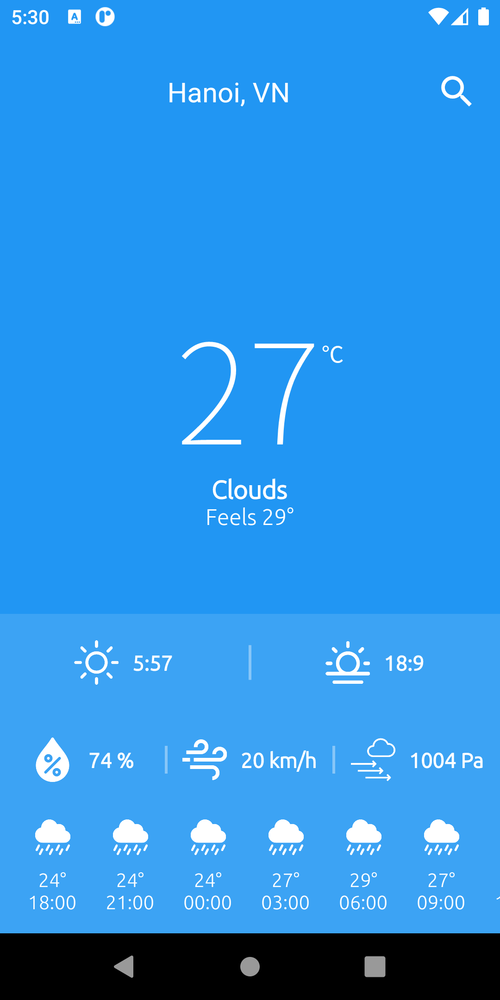
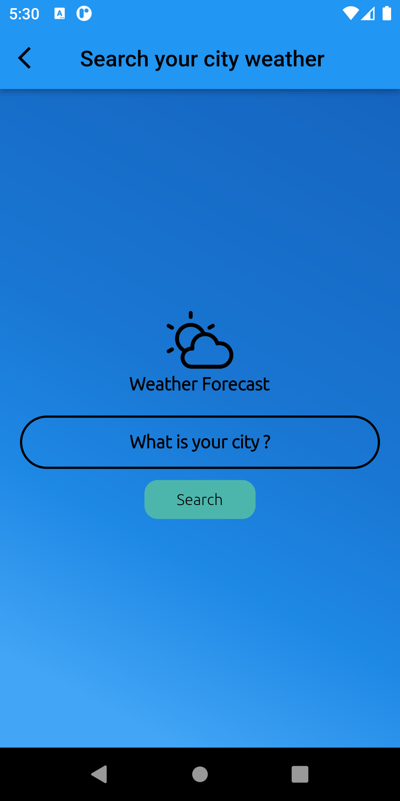
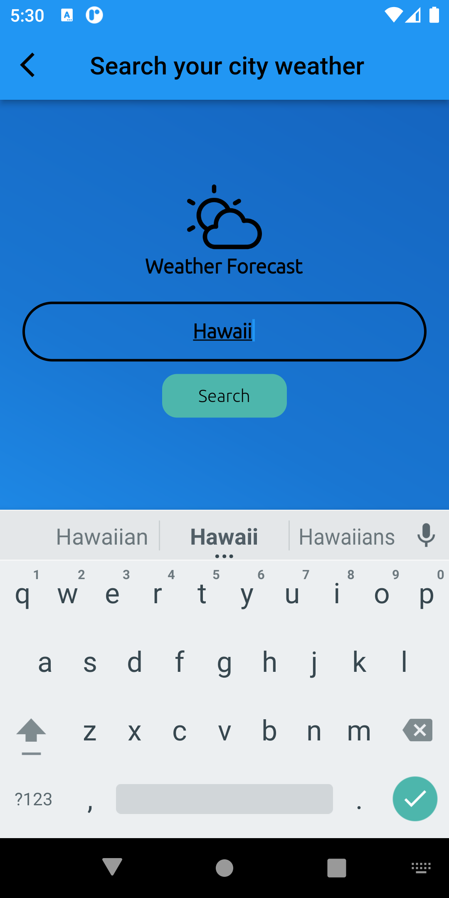
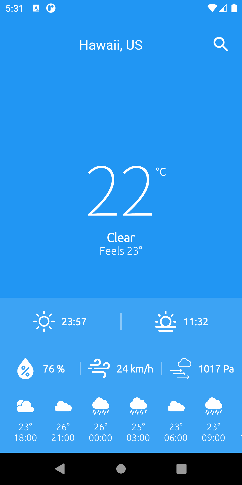

# Weather forecast app

### Homework exercises for INT3120_2

App apk file path: /app.apk

Code using for calling API: /lib/screens/search.dart
### getWeatherOfCity: 
- This function will call an api to get weather data of an city by using an open api from openweathermap
```dart
Future getWeatherOfCity() async {
    if (city == "" || city == null) {
      return;
    }
    http.Response response = await http.get(
        'https://api.openweathermap.org/data/2.5/weather?q=$city&appid=36891560b96f6d92de4896361eadc34a&units=metric');
    if (response.statusCode == 200) {
      data = jsonDecode(response.body);
      forecast = await getForecastOfCity();
      Navigator.pushNamed(context, '/home',
          arguments: ScreenArguments(data, forecast));
      showSpinner = false;
    } else {
      print(response.statusCode);
    }
  }
```

### getForecastOfCity:
+ This function will call an api to get forecast data of an city by using an open api from openweathermap
```dart
  Future getForecastOfCity() async {
    http.Response response = await http.get(
        'https://api.openweathermap.org/data/2.5/forecast?q=$city&appid=36891560b96f6d92de4896361eadc34a&units=metric');
    if (response.statusCode == 200) {
      return (jsonDecode(response.body));
    } else {
      print(response.statusCode);
    }
  }

```

# App preview

   
